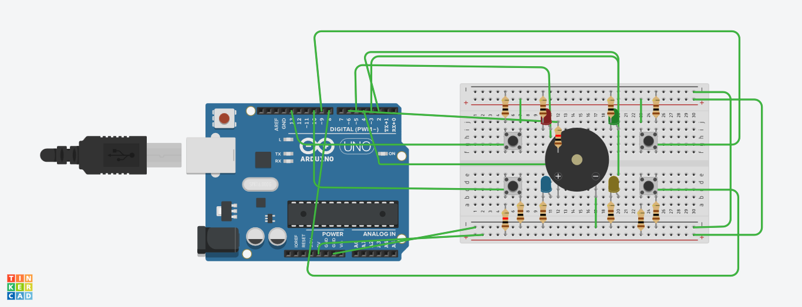

# Genius

## Integrantes
- Felipe Ferreira Colona - 15636525
- 
- 

## Descrição
O projeto se trata de uma réplica do jogo de memorização Genius, utilizando Arduino. Nesse contexto, a cada rodada um LED (entre vermelho, azul, verde e amarelo) é escolhido aleatoriamente e adicionado à sequência corrente. Assim, a sequência de cores é sinalizada e, caso o jogador consiga reproduzí-la, uma nova rodada se inicia, aumentando em um o tamanho da sequência. Enfim, caso o jogador perca, o jogo reinicia para a primeira rodada com uma sequência de tamanho um.

## Componentes
| Quantidade      | Componente              | Valor   |
| --------------- | ----------------------- | ------- |
| 0x              | Placeholder             | R$0,00  |
| 0x              | Placeholder             | R$0,00  |
| TOTAL           |                         | R$00,00 |

## Software

## Tinkercad

[Link](#)